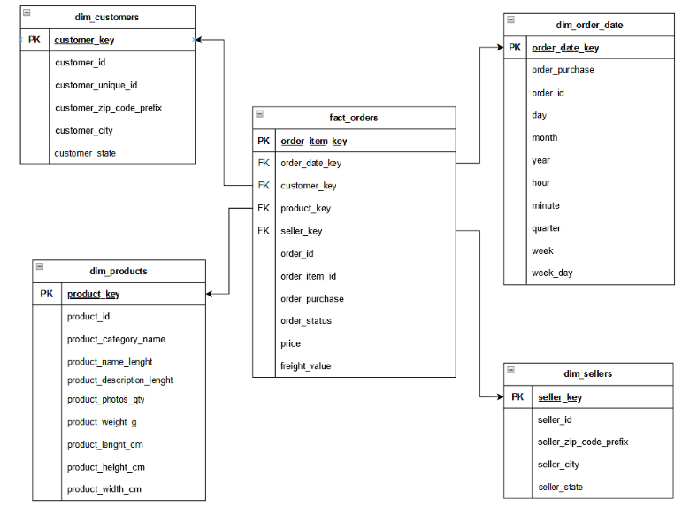

# E-commerce: Data Pipeline
Pipeline de dados contendo ingestão, armazenamento, transformação e disponibilização de dados de E-commerce. 

**Tecnologias**: Docker, Python, Airflow, Postgres, dbt, Metabase, Flask

## Índice
1. [Case](#case)
2. [Objetivos](#objetivos)
3. [Conjunto de dados](#conjunto-de-dados)
4. [Tecnologias](#tecnologias)
5. [Arquitetura](#arquitetura)
6. [Modelagem de dados](#modelagem-de-dados)
7. [Orquestração e fluxo de trabalho](#orquestração-e-fluxo-de-trabalho)
8. [Transformação de dados](#tranformação-de-dados)
9. [Visualização de dados](#visualização-de-dados)
10. [Próximos passos e melhorias](#próximos-passos-e-melhorias)

## Case

O projeto **“E-commerce: Data Pipeline”** tem o objetivo de construir uma arquitetura de dados e modelagem dimensional para extrair informações de dados transacionais e dados de funil de marketing de uma empresa de e-commerce.

Os dados foram processados em um pipeline “ELT” e armazenados em um Data Warehouse para consultas e análises dos stakeholders.

## Objetivos

* Entendimento do problema de negócios e das fontes de dados.
* Exploração de estrututa dos dados, volume, granularidade e frequência,adequando estrutura de dados as tecnologias disponíveis.
* Modelagem de dados dimensional, 'star-schema', adequadas para consultas e análises da métricas de negócio.
* Desenvolvimento de ingestão de dados e transformações para o Data Warehouse(DW)
* Orquestração do fluxo de trabalho da arquitetura de dados
* Disponibilização dos dados para consultas e visualizações

## Conjunto de dados

Os datasets são oriundos do [**Kaggle**](https://www.kaggle.com/datasets), plataforma que disponibiliza datasets abertos para extração e análises e predições.

Os datasets foram inseridos nas fontes da arquitetura do pipeline, de forma a proporcionar a ingestão de dados.

- [Dados transacionais de uma plataforma de E-commerce](https://www.kaggle.com/datasets/olistbr/brazilian-ecommerce) (Olist Store), possuindo ~100mil registros de pedidos do período 2016-2018. (**Postgres**)

- [Dados do funil de marketing](https://www.kaggle.com/datasets/olistbr/marketing-funnel-olist), contendo registro de leads qualificados entre 2017-2018.- (**API** em Flask).

## Tecnologias

 * Local: Arquitetura em máquina local
 * Linguagens: Python, SQL
 * Containers: **Docker** -  containers para desenvolvimento e uso das tecnologias da arquitetura
 * Orquestração e fluxo de trabalho: **Airflow**
 * Fontes:
    * **Postgres** - dados transacionais
 *  * **API (Flask)** - dados de funil de marketing
 * Armazenamento: **Postgres** - Staging area e armazenamento de dados.
 * Transformação: **dbt** - (dbt-core) transformação de dados para o Data Warehouse
 * Data Warehouse: **Postgres** - Disponibilização de dados em camada analítica.
 * Visualização de dados: **Metabase** - análises, dashboards e relatórios.

## Arquitetura

A arquitetura desenvolvida teve como propósito abordar de forma mais realística as etapas do fluxo das informações. Os datasets de registros transacionais foram alocados em um banco de dados **Postgres**. Os dados de funil marketing serão extraídos de uma API desenvolvida em **Flask**. Utilizou-se containers(**Docker**) para desenvolver toda a arquitetura.

## Modelagem de dados

A partir das informações das fontes de dados transacionais, foi realizada a modelagem dimensional em modelo 'star-schema'. A tabela fato e suas dimensões foram projetadas para possibilitar a análise e visualizações de métricas gerais do e-commerce.

## Orquestração e fluxo de trabalho
 - Foram utilizadas 2 Dags para ingestão de dados e transformações de dados transacionais.
    * **DAG (incremental** + **dbt**): ingestão de dados incrementais de tabelas conforme a data do pedido (realização de backfill em período entre 2016-2018). Transformação de dados utilizando o **dbt** e disponibilização para o Data Warehouse(DW).
    * **DAG tabela**: ingestão de dados de tabelas que não possuiam atributos de timestamp e/ou tabelas mais estáticas e/ou menor volume de dados ao longo do tempo. (sellers, products, geolocation)

As tarefas do orquestrador do fluxo de trabalho fundamentaram-se em etapas de extração e carregamento dos dados incrementais, integrando os bancos de dados da 'fonte' e do 'staging'. Após a ingestão incremental, o **dbt** executa as transformações para o DW.

## Transformação de dados
 As transformações dos dados da área de staging para o DW foram realizadas utilizando o **dbt(data build tool)** para realização da modelagem dimensional. As transformações em SQL basearam-se em:
 * Verificação de dados não nulos;
 * Renomear colunas
 * Conversões de tipos de dados/casting;
 * Chaves substitutas (surrogates keys)
 * Joins

Testes de unicidade e valores não nulos foram realizados no **dbt**, abrangendo colunas de indentificadores (ids) e valores de receita das camadas 'staging' e 'serving'.

## Visualização de dados

**Metabase**: consultas de dados do Data Warehouse e dashboard apresentando principais métricas solicitadas pelos stakeholders como número de pedidos, receita, ticket médio e tamanho da cesta.

## Próximos passos e melhorias
- Refatoração de códigos das DAGs (extração, carregamento, operators, decorators)
- Melhorias em versionamento de modificações e branches.
- Melhorias em testes e documentações.
- Modelagem de dados para informações de funil marketing.
- Consumo da API, para ingestão de dados do funil de marketing para a camada ''staging'
- (Dbt) Transformações de dados de funil de marketing.
